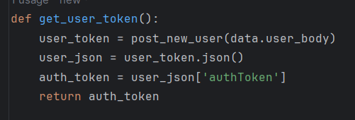
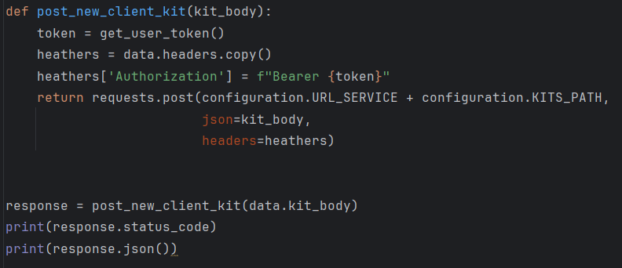
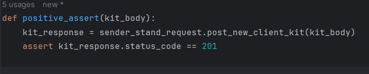
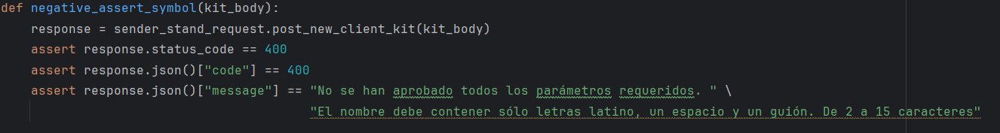
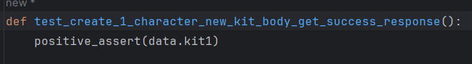

#  **Proyecto Urban Grocers** 

En este proyecto se trata de automatizar la lista de comprobacion del campo **name**  en la solicitud de creacion de un kit de productos. Para ello se necesita crear primero un usurio.

El primer paso es instalar en Pychart pip, piptest, request,  intalacion?
Segundo paso, enlazar la cuenta de GitHub Desktop a la plataforma de Tripleten a traves de la API que aparece en la entregada del proyecto Sprint 7.
Luego, ve a GitHub y clona el nombre del repositorio **qa-project-Urban-Grocers-app-es**  a la computadora local. Y ahora si a empezar a trabajar. Manos a la otra!

Primordialmente, abre y lee la documetacion del API de "Urban Grocers".  Toda la documentacion necesaria se encuentra en el archivo Configuration. 
En el archivo Data se encuentra el diccionario para poder implementar las funciones necesarias en el archivo Sender_Stand_Request.
Se encuentran almacenadas las funciones de automatizacion de las solicitudes de las pruebas positivas y negativas en el archivo Create_kit_name_kit_test.

## Que podemos apreciar en los archivos:

### _Configuration:_
* La URL del servidor. 
* El Endpoint para consultar la documentacion. 
* Los Endpoints para crear un nuevo usuario y un kit.

### _Data:_ 
* El Heather del  aplicativo.
* El parametro de la variante **user_body** necesario para la creacion de un nuevo usuario con el conjunto minimo de datos. Como por ejemplo: nombre, numero telefonico y direccion, en formato JSON.
* El parametro de la variante **kit_body** en formato JSON
* Los nueves parametros de la variante **name** en formato Json. Con las que se realizaran las pruebas del archivo create_kit_name_test.

### _Sender_stand_request:_ 
* La funcion **def** con el metodo **post** para crear un nuevo usuario. 

  
  >def post_new_user(body):
> 
        return requests.post(configuration.URL_SERVICE + configuration.CREATE_USER_PATH,
   
                         json=body,
                         headers=data.headers)

  

  
* La funcion **def** con el metodo **get** para solicitar la autenticacion del "auth_token" del usuario, ya que es necesaria para la creacion del kit.

  
* La funcion **def** con el metodo **get** de crear un nuevo kit.
  
  

### _Create_kit_name_kit:_
* En la prueba positiva de automatizacion de los kits utilizamos la funcion **def** con el metodo de comprobacion **positive_assert**.
  

* En la prueba negativa de automatizacion de los kits utilizamos la funcion **def** con el metodo de comprobacion **negative_assert**. Con sus respectivos mensajes. 

* La lista de comprobacion positiva y negativa de los nueve kits, contiene la funcion **def** y el sufijo **test** para indicar que una prueba.
  
Para realizar la pruebas es necesario modificar el nombre de la prueba cambiandolo de manera explicatica del caso. Y la variable **(kit_body)** en el metodo **assert**

* Las pruebas positivas dieron un 100% de eficacia. De manera contraria sucede con las pruebas negativas,
ya que se han mostrado unos errores en los kits 3, 4, 8 y 9.

La prueba 3 deveria de dar como resultado un error 400 pero el actual es un 201 creando el kit.
La prueba 4 deveria de dar como resultado un error 400 pero el actual es un 201 creando el kit.
La prueba 8 deveria de dar como resultado un error 400 pero el actual es un 500.
La prueba 9 deveria de dar como resultado un error 400 pero el actual es un 201 creando el kit.

